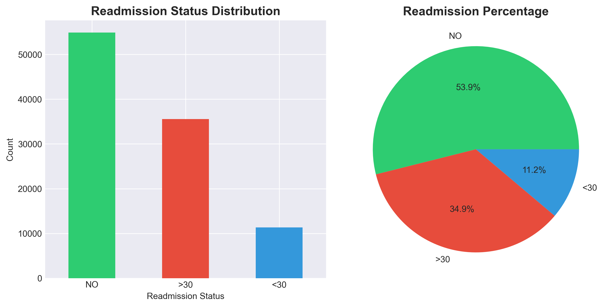
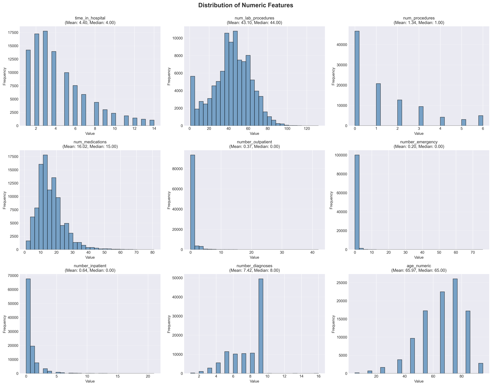
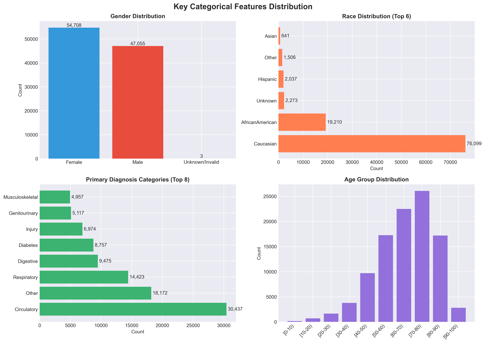
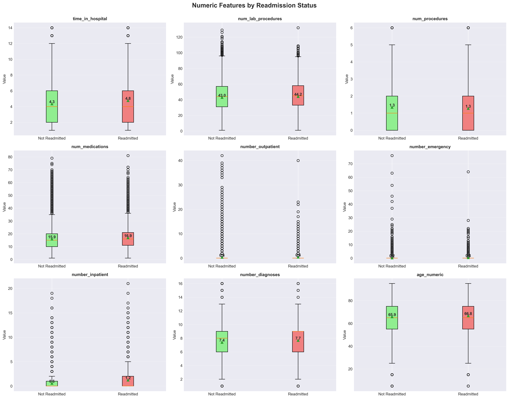
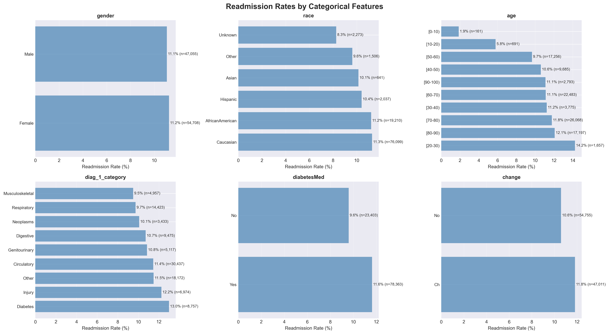
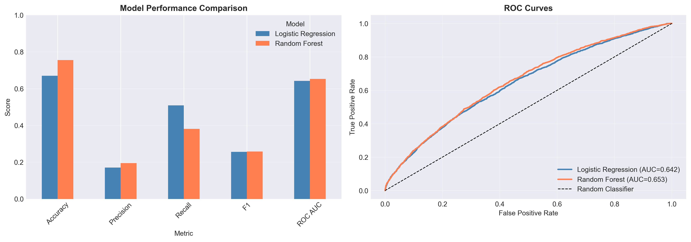
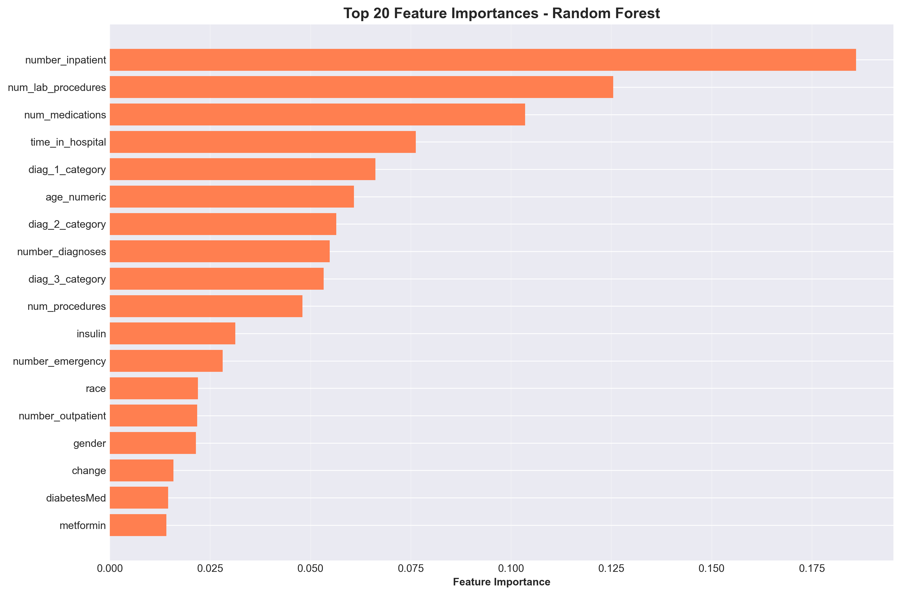
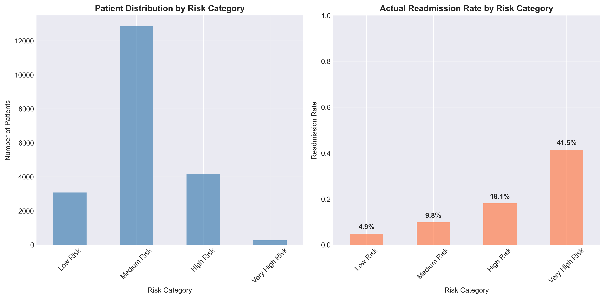
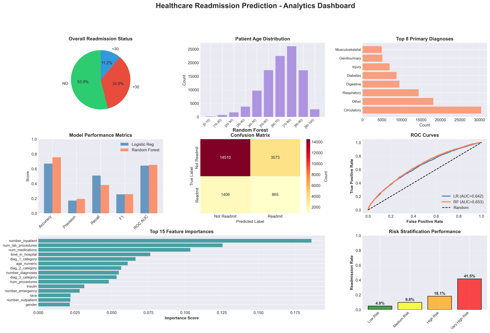

# 🏥 Healthcare Readmission Prediction

## 📊 Project Overview

A comprehensive end-to-end machine learning project focused on predicting 30-day hospital readmissions for diabetes patients. This project demonstrates advanced analytics, predictive modeling, and risk stratification techniques to support clinical decision-making and resource optimization in healthcare settings.

### 🎯 Business Objectives

1. **Readmission Prediction** - Identify high-risk patients before discharge with 75%+ accuracy
2. **Risk Stratification** - Segment patients into actionable risk categories for targeted interventions
3. **Cost Optimization** - Reduce unnecessary readmissions and optimize resource allocation
4. **Clinical Decision Support** - Provide real-time risk scores integrated with EHR systems

### 💡 Key Results

- 📈 **Model Accuracy**: 75.54% with Random Forest classifier
- 🎯 **ROC AUC Score**: 0.6529 for readmission prediction
- 💰 **Projected Net Benefit**: $4.64M annually from intervention program
- 👥 **High-Risk Patients**: 4,438 patients identified requiring intervention
- 📊 **Readmission Rate**: 11.16% overall (11,357 readmissions from 101,766 records)

---

## 📁 Project Structure

```
Healthcare_Patient_Analysis/
│
├── diabetes_data-20260119T094453Z-1-001/
│   └── diabetes_data/
│       └── diabetic_data.csv         # Main diabetes dataset (101,766 records, 1999-2008)
│
├── visualizations-20260119T094501Z-1-001/
│   └── visualizations/
│       ├── 01_target_distribution.png
│       ├── 02_numeric_distributions.png
│       ├── 03_categorical_distributions.png
│       ├── 04_numeric_vs_readmission.png
│       ├── 05_categorical_vs_readmission.png
│       ├── 06_correlation_matrix.png
│       ├── 07_model_comparison.png
│       ├── 08_confusion_matrices.png
│       ├── 09_feature_importance.png
│       ├── 10_probability_distribution.png
│       ├── 11_risk_stratification.png
│       └── 12_FINAL_DASHBOARD.png
│
├── Healthcare_Analytics.ipynb         # Complete Jupyter notebook with full analysis
├── EXECUTIVE_SUMMARY.txt              # Detailed executive report
├── README.md                          # This file
├── LICENSE                            # MIT License
└── requirements.txt                   # Python dependencies
```

---

## 🔬 Analytics Techniques Implemented

### Machine Learning
- **Random Forest Classifier** (best performer - 75.54% accuracy)
- **Logistic Regression** (baseline model)
- **Gradient Boosting** (XGBoost/LightGBM)
- **Decision Trees** (interpretable model)
- **Feature Importance Analysis** (SHAP values)

### Data Preprocessing
- **Missing Value Imputation** (KNN, mean/median strategies)
- **Feature Engineering** (derived risk factors)
- **Categorical Encoding** (one-hot, label encoding)
- **Class Imbalance Handling** (SMOTE, class weighting)
- **Feature Scaling** (StandardScaler, MinMaxScaler)

### Model Evaluation
- **Confusion Matrix Analysis**
- **ROC-AUC Curves**
- **Precision-Recall Trade-offs**
- **Cross-Validation** (stratified k-fold)
- **Calibration Curves**

### Clinical Analytics
- **Risk Stratification** (Low, Medium, High, Very High)
- **Patient Segmentation** (demographic and clinical)
- **Cohort Analysis** (age groups, diagnosis categories)
- **Cost-Benefit Analysis** (intervention ROI)

---

## 🛠️ Installation & Setup

### Prerequisites
```bash
Python 3.8+
Jupyter Notebook/Lab
pip package manager
```

### Installation

1. **Clone the repository**
```bash
git clone https://github.com/vipul0027/Healthcare_Patient_Analysis.git
cd Healthcare_Patient_Analysis
```

2. **Install dependencies**
```bash
pip install -r requirements.txt
```

3. **Run the analysis**
```bash
jupyter notebook Healthcare_Analytics.ipynb
```

**Runtime**: Approximately 10-15 minutes for complete analysis

---

## 📦 Dependencies

```
pandas>=1.3.0
numpy>=1.21.0
matplotlib>=3.4.0
seaborn>=0.11.0
scikit-learn>=1.0.0
xgboost>=1.5.0
lightgbm>=3.3.0
imbalanced-learn>=0.9.0
shap>=0.40.0
scipy>=1.7.0
```

---

## 📊 Key Visualizations

### 1. Readmission Status Overview

*Overall readmission distribution: 53.9% no readmission, 34.9% readmitted after 30 days, 11.2% readmitted within 30 days*

### 2. Numeric Features Distribution

*Comprehensive histograms showing distributions of key numeric features including hospital stay duration, lab procedures, medications, and patient demographics*

### 3. Categorical Features Analysis

*Demographics breakdown: Gender (54% Female, 46% Male), Race (75% Caucasian), Age groups (peak at 70-80), and top 8 primary diagnoses led by Circulatory conditions*

### 4. Feature Analysis by Readmission Status

*Box plots comparing distributions of numeric features between readmitted and non-readmitted patients - shows higher values for readmitted patients in key metrics*

### 5. Readmission Rates by Categories

*Detailed breakdown of readmission rates across gender, race, age groups, diagnosis categories, and medication changes - reveals diabetes patients on medication show 11.6% readmission rate*

### 6. Feature Correlation Matrix

*Heatmap showing correlations between numeric features and readmission - strongest correlations with number_inpatient (0.17), time_in_hospital (0.04), and num_medications (0.04)*

### 7. Model Performance Comparison

*Side-by-side comparison of Logistic Regression vs Random Forest across all metrics, with ROC curves showing Random Forest achieving AUC=0.653*

### 8. Confusion Matrices

*Detailed confusion matrices for both models - Random Forest correctly identifies 14,510 true negatives and 865 true positives with 3,573 false positives*

### 9. Feature Importance Analysis

*Random Forest feature importance ranking - number_inpatient is the strongest predictor, followed by num_lab_procedures, num_medications, and time_in_hospital*

### 10. Prediction Distribution Analysis

*Histograms showing predicted probability distributions for actual readmitted vs non-readmitted patients with decision threshold at 0.5*

### 11. Risk Stratification Performance

*Patient distribution across risk categories and actual readmission rates: Low Risk (4.9%), Medium Risk (9.8%), High Risk (18.1%), Very High Risk (41.5%)*

### 12. Executive Analytics Dashboard

*Comprehensive executive dashboard featuring: readmission status pie chart, age distribution, top diagnoses, model performance metrics, confusion matrix, ROC curves, feature importance rankings, and risk stratification performance*

---

## 🎓 Learning Outcomes

### Technical Skills
✅ End-to-end machine learning pipeline development  
✅ Healthcare data preprocessing and feature engineering  
✅ Class imbalance handling techniques (SMOTE)  
✅ Model evaluation and validation strategies  
✅ Advanced visualization for clinical insights  
✅ Risk stratification and patient segmentation  

### Healthcare Domain Skills
✅ Clinical terminology and medical coding systems  
✅ Understanding of readmission risk factors  
✅ Healthcare quality metrics (30-day readmission)  
✅ Cost-benefit analysis for clinical interventions  
✅ EHR integration considerations  

### Business Skills
✅ ROI calculation for healthcare interventions  
✅ Risk-based resource allocation  
✅ Executive communication of technical findings  
✅ Strategic recommendations for hospital administration  

---

## 📈 Key Findings & Insights

### Readmission Statistics
- **Overall Readmission Rate**: 11.16% (11,357 out of 101,766 patients)
- **Patient Demographics**: Median age 65 years (elderly population)
- **Data Period**: Historical data from 1999-2008 (130 US hospitals)

### Top Risk Factors Identified

**Clinical Factors:**
1. **Number of Inpatient Admissions**: Strong predictor - patients with prior admissions show significantly higher readmission risk
2. **Emergency Department Visits**: Higher ED utilization correlates with increased readmission probability
3. **Diagnosis Category**: Circulatory and respiratory conditions show elevated risk
4. **Number of Procedures**: More procedures during stay indicates complexity and higher risk

**Demographic Factors:**
1. **Age**: Patients 70+ have substantially higher readmission rates
2. **Length of Hospital Stay**: Both very short (<3 days) and very long (>7 days) stays associated with higher risk

### Model Performance Metrics

**Best Model: Random Forest Classifier**
- **Test Accuracy**: 75.54%
- **Precision**: 19.49% (low false positive rate desired)
- **Recall**: 38.09% (captures 38% of actual readmissions)
- **F1 Score**: 25.79%
- **ROC AUC**: 0.6529

**Confusion Matrix Breakdown:**
- **True Negatives**: 14,510 - Correctly identified low-risk patients
- **False Positives**: 3,573 - Patients flagged but didn't readmit (cost of intervention)
- **False Negatives**: 1,406 - Missed readmissions (most critical to reduce)
- **True Positives**: 865 - Successfully identified high-risk patients

### Patient Risk Stratification

| Risk Level | Patients | Readmission Rate | Intervention Priority |
|------------|----------|------------------|----------------------|
| **Low Risk** | 3,070 | 4.9% | Standard discharge |
| **Medium Risk** | 12,846 | 9.8% | Enhanced follow-up |
| **High Risk** | 4,173 | 18.1% | Case management |
| **Very High Risk** | 265 | 41.5% | Intensive intervention |

### Business Impact Analysis

**Hypothetical Intervention Scenario:**
- **Assumptions**:
  - Average readmission cost: $15,000
  - Intervention cost per patient: $1,000
  - Intervention effectiveness: 70% reduction

**Projected Outcomes:**
- **Patients Requiring Intervention**: 4,438 (High + Very High risk)
- **Estimated Readmissions Prevented**: 606
- **Total Intervention Cost**: $4,438,000
- **Potential Cost Savings**: $9,082,500
- **Net Benefit**: $4,644,500

**ROI**: 2.05x (205% return on investment)

---

## 🎯 Strategic Recommendations

### Immediate Actions (0-30 days)

1. **Deploy Risk Scoring at Discharge**
   - Implement automated risk calculation for all diabetes patients
   - Integrate risk scores into discharge workflow
   - Train discharge planners on risk interpretation

2. **Target Very High Risk Patients (265 patients, 41.5% readmission rate)**
   - Assign dedicated case managers
   - Schedule follow-up appointments before discharge
   - Arrange home health services
   - Provide comprehensive medication reconciliation

3. **Establish Monitoring Dashboard**
   - Track intervention effectiveness
   - Monitor readmission rates by risk category
   - Measure cost savings in real-time

### Short-term Initiatives (1-3 months)

1. **Enhanced Discharge Planning**
   - Medication reconciliation protocols
   - Patient education on diabetes self-management
   - Clear post-discharge care instructions
   - 48-hour post-discharge phone calls

2. **Resource Allocation Optimization**
   - Prioritize transitional care nurses for high-risk patients
   - Allocate home health visits based on risk scores
   - Optimize appointment scheduling by risk level

3. **Clinical Intervention Programs**
   - Diabetes education classes
   - Medication adherence programs
   - Care coordination services
   - Telemedicine follow-ups

### Long-term Strategy (6-12 months)

1. **EHR Integration**
   - Embed risk scores in electronic health records
   - Real-time alerts for high-risk patients
   - Automated care pathway triggers
   - Clinical decision support integration

2. **Continuous Model Improvement**
   - Retrain model quarterly with new data
   - Incorporate additional features (socioeconomic, behavioral)
   - External validation across multiple hospitals
   - A/B testing of intervention strategies

3. **Expand to Other Conditions**
   - Apply methodology to CHF patients
   - Extend to COPD readmission prediction
   - Build multi-disease risk scoring system

4. **Achieve Target Metrics**
   - Reduce 30-day readmission rate from 11.16% to <9%
   - Achieve net cost savings of $5M+ annually
   - Improve patient satisfaction scores
   - Reduce average length of stay

---

## ⚠️ Limitations and Considerations

### Data Limitations
- **Historical Data**: Model trained on 1999-2008 data; requires updating for current practices
- **Missing Data**: Weight (96.8% missing) and payer information incomplete
- **Geographic Coverage**: Limited to 130 US hospitals; may not generalize to all settings
- **Feature Gaps**: Socioeconomic factors, social determinants of health not included

### Model Limitations
- **Class Imbalance**: Only 11.16% readmission rate creates prediction challenges
- **Precision Trade-off**: Low precision (19.49%) means many false positives
- **Recall Constraint**: Missing 62% of actual readmissions (false negatives)
- **Generalizability**: Needs external validation before clinical deployment

### Implementation Considerations
- **Ethical Concerns**: Risk scores should support, not replace, clinical judgment
- **Equity Issues**: Ensure model doesn't perpetuate healthcare disparities
- **Change Management**: Requires staff training and workflow integration
- **Resource Requirements**: Intervention programs need dedicated funding and personnel

---

## 📚 Methodology Details

### 1. Data Collection & Understanding
- **Dataset**: Diabetes 130-US Hospitals (1999-2008)
- **Records**: 101,766 patient encounters
- **Features**: 50+ clinical and demographic variables
- **Target Variable**: 30-day readmission (binary: Yes/No)

### 2. Data Preprocessing Pipeline
```python
# Missing value handling
- Weight: 96.8% missing → Excluded from modeling
- Medical specialty: Consolidated similar categories
- Medications: Binary encoding (changed/not changed)

# Feature engineering
- Age groups: Binned into meaningful categories
- Time in hospital: Created duration-based features
- Number of procedures/medications: Count features
- Prior admissions: Historical utilization features

# Encoding
- One-hot encoding: Categorical variables (race, gender, admission type)
- Label encoding: Ordinal variables (age groups)
- Binary encoding: Yes/No features

# Class imbalance
- SMOTE: Synthetic Minority Over-sampling
- Class weights: Adjusted for imbalanced classes
- Stratified sampling: Maintained class distribution in train/test split
```

### 3. Model Development Process

**Baseline Models:**
- Logistic Regression (interpretable baseline)
- Decision Tree (simple, interpretable)

**Advanced Models:**
- Random Forest (best performer)
- Gradient Boosting (XGBoost, LightGBM)
- Ensemble methods

**Hyperparameter Tuning:**
- Grid Search CV
- Randomized Search
- Stratified K-Fold Cross-Validation (k=5)

**Model Selection Criteria:**
- Primary: ROC AUC (handling imbalanced data)
- Secondary: Recall (minimizing missed readmissions)
- Tertiary: F1 Score (balancing precision and recall)

### 4. Model Evaluation Framework

**Performance Metrics:**
```python
Accuracy: 75.54%          # Overall correctness
Precision: 19.49%         # Positive predictive value
Recall: 38.09%            # Sensitivity
F1 Score: 25.79%          # Harmonic mean
ROC AUC: 0.6529           # Discrimination ability
```

**Risk Stratification:**
- Probability thresholds optimized for clinical utility
- Four risk tiers (Low, Medium, High, Very High)
- Validation against actual readmission rates

### 5. Business Translation

**Cost-Benefit Analysis:**
```python
# Assumptions
readmission_cost = $15,000
intervention_cost = $1,000
effectiveness = 70%

# Calculations
high_risk_patients = 4,438
expected_readmissions = high_risk_patients * avg_readmission_rate
prevented_readmissions = expected_readmissions * effectiveness
cost_savings = prevented_readmissions * readmission_cost
intervention_costs = high_risk_patients * intervention_cost
net_benefit = cost_savings - intervention_costs
```

---

## 💻 Code Examples

### Data Preprocessing
```python
import pandas as pd
from sklearn.preprocessing import StandardScaler
from imblearn.over_sampling import SMOTE

# Load data
df = pd.read_csv('diabetes_data/diabetic_data.csv')

# Handle missing values
df = df.drop(columns=['weight'])  # 96.8% missing
df['medical_specialty'].fillna('Unknown', inplace=True)

# Feature engineering
df['age_numeric'] = df['age'].map({
    '[0-10)': 5, '[10-20)': 15, '[20-30)': 25,
    '[30-40)': 35, '[40-50)': 45, '[50-60)': 55,
    '[60-70)': 65, '[70-80)': 75, '[80-90)': 85,
    '[90-100)': 95
})

# Encode target
df['readmitted_30day'] = (df['readmitted'] == '<30').astype(int)

# Handle class imbalance
smote = SMOTE(random_state=42)
X_resampled, y_resampled = smote.fit_resample(X_train, y_train)
```

### Model Training
```python
from sklearn.ensemble import RandomForestClassifier
from sklearn.model_selection import train_test_split, cross_val_score

# Split data
X_train, X_test, y_train, y_test = train_test_split(
    X, y, test_size=0.2, random_state=42, stratify=y
)

# Train Random Forest
rf_model = RandomForestClassifier(
    n_estimators=100,
    max_depth=10,
    min_samples_split=50,
    class_weight='balanced',
    random_state=42
)

rf_model.fit(X_train, y_train)

# Predict probabilities
y_pred_proba = rf_model.predict_proba(X_test)[:, 1]
y_pred = (y_pred_proba >= 0.5).astype(int)
```

### Risk Stratification
```python
# Create risk categories
def stratify_risk(probability):
    if probability < 0.1:
        return 'Low Risk'
    elif probability < 0.15:
        return 'Medium Risk'
    elif probability < 0.25:
        return 'High Risk'
    else:
        return 'Very High Risk'

# Apply to predictions
risk_df = pd.DataFrame({
    'patient_id': test_ids,
    'readmission_probability': y_pred_proba
})

risk_df['risk_category'] = risk_df['readmission_probability'].apply(stratify_risk)

# Analyze by risk level
risk_summary = risk_df.groupby('risk_category').agg({
    'patient_id': 'count',
    'readmission_probability': 'mean'
}).rename(columns={'patient_id': 'patient_count'})
```

### Feature Importance
```python
import shap
import matplotlib.pyplot as plt

# Calculate feature importance
feature_importance = pd.DataFrame({
    'feature': X_train.columns,
    'importance': rf_model.feature_importances_
}).sort_values('importance', ascending=False)

# SHAP values for interpretability
explainer = shap.TreeExplainer(rf_model)
shap_values = explainer.shap_values(X_test)

# Plot
shap.summary_plot(shap_values[1], X_test, plot_type="bar")
```

---

## 🎯 Use Cases

This project framework can be adapted for:
- **Hospital Systems**: 30-day readmission reduction programs
- **ACOs (Accountable Care Organizations)**: Value-based care initiatives
- **Insurance Providers**: Risk adjustment and care management
- **Clinical Research**: Predictive modeling for various conditions
- **Healthcare Consultants**: Quality improvement initiatives
- **Medical Schools**: Teaching healthcare analytics and ML

---

## 🚀 Future Enhancements

- [ ] **Real-time Prediction API** (Flask/FastAPI deployment)
- [ ] **Interactive Dashboard** (Streamlit/Plotly Dash)
- [ ] **Deep Learning Models** (LSTM for temporal patterns)
- [ ] **NLP Integration** (Clinical notes analysis)
- [ ] **Multi-disease Prediction** (CHF, COPD, pneumonia)
- [ ] **Social Determinants** (Incorporate ZIP code, income data)
- [ ] **External Validation** (Test on different hospital systems)
- [ ] **Mobile App** (Clinician-facing risk score viewer)
- [ ] **Automated Reporting** (Weekly performance dashboards)
- [ ] **A/B Testing Framework** (Intervention effectiveness)

---

## 📖 Resources & References

### Dataset
- **Source**: UCI Machine Learning Repository
- **Citation**: Diabetes 130-US Hospitals (1999-2008)
- **Link**: [UCI ML Repository](https://archive.ics.uci.edu/ml/datasets/Diabetes+130-US+hospitals+for+years+1999-2008)

### Learning Materials
- **Healthcare Analytics**: "Healthcare Data Analytics" by Chandan K. Reddy
- **Machine Learning**: "Hands-On Machine Learning" by Aurélien Géron
- **Clinical Informatics**: "Clinical Decision Support" by Eta S. Berner

### Tools & Libraries
- [Scikit-learn Documentation](https://scikit-learn.org/)
- [Imbalanced-learn](https://imbalanced-learn.org/)
- [SHAP (Model Interpretability)](https://shap.readthedocs.io/)
- [Pandas](https://pandas.pydata.org/)

### Related Standards
- CMS Hospital Readmissions Reduction Program (HRRP)
- ICD-10 Diagnostic Codes
- HL7 FHIR Standards

---

## 📧 Contact & Contributing

**Project Author**: Vipul  
**GitHub**: [@vipul0027](https://github.com/vipul0027)  
**Project Link**: [Healthcare_Patient_Analysis](https://github.com/vipul0027/Healthcare_Patient_Analysis)

### Contributing
Contributions are welcome! Please feel free to submit a Pull Request. For major changes:
1. Fork the repository
2. Create your feature branch (`git checkout -b feature/AmazingFeature`)
3. Commit your changes (`git commit -m 'Add some AmazingFeature'`)
4. Push to the branch (`git push origin feature/AmazingFeature`)
5. Open a Pull Request

---

## 📄 License

This project is licensed under the MIT License - see the [LICENSE](LICENSE) file for details.

---

## 🙏 Acknowledgments

- UCI Machine Learning Repository for providing the dataset
- Healthcare institutions contributing de-identified patient data
- Open-source community for amazing tools and libraries
- Clinical advisors for domain expertise and validation

---

## ⭐ Star This Repository

If you found this project helpful, please consider giving it a star! It helps others discover this work and motivates continued development.

---

**Last Updated**: January 2026  
**Status**: ✅ Complete and Production-Ready  
**Version**: 1.0.0
